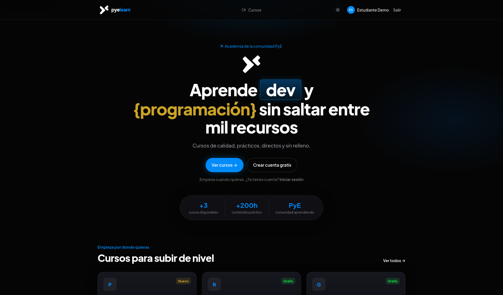

# pye-learn

Proyecto personal de academia web. **No oficial** · no afiliado a [SomosPYE](https://github.com/somospye).

[](https://pye-learn.vercel.app)
[](LICENSE)



## Qué es

SPA en **React + Vite + TypeScript**. Catálogo de cursos, auth, inscripción y progreso con **mocks en el navegador** (`localStorage`). Sin backend ni credenciales reales.

## Stack

- React 19 · Vite · TypeScript · Tailwind CSS · React Router

## Demo

https://pye-learn.vercel.app

## Arranque local

```bash
npm install
npm run dev   # http://localhost:5173
```

```bash
npm run lint
npm run build
npm run preview
```

## Deploy

Vercel construye desde la raíz (`vercel.json`). No requiere variables de entorno.

## Historial monorepo

El scaffold anterior (Go API + Postgres + Railway) está en la rama [`archive/monorepo`](https://github.com/FraVelz/pye-learn/tree/archive/monorepo).

## Licencia

[MIT](LICENSE)
